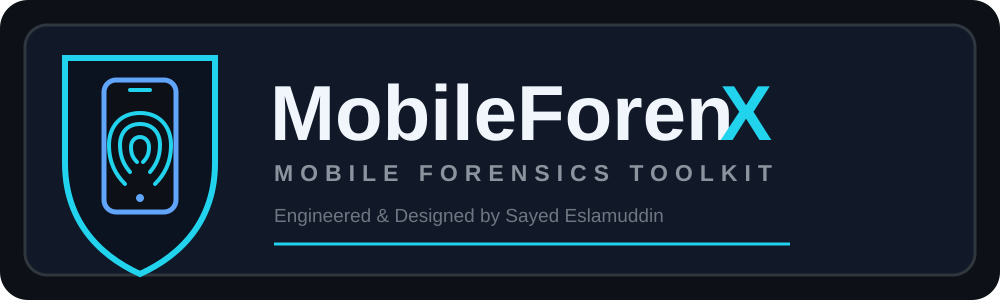

<div align="center">


<br>

# MobileForenX

### Mobile Forensics Toolkit

**Engineered & Designed by Sayed Eslamuddin**

[](#requirements)
[](#requirements)
[](#docker)
[](#features)

**Extract • Analyze • Investigate • Index • Report**

</div>

---

## 📖 About

**MobileForenX** is a modular **Mobile Forensics Toolkit** designed to organize evidence processing, artifact extraction, analysis, indexing, investigation, and forensic reporting in one workflow.

The project combines a practical launcher with dedicated forensic-processing modules.

> **`mft` is the launcher command. MobileForenX is the toolkit.**

---

## ✨ Features

- 📱 Mobile evidence processing
- 🔐 Evidence validation and cryptographic hashing
- 📦 Content extraction
- 🗂️ Evidence indexing
- 🔎 Evidence browser
- 📊 Forensic reporting
- 🗄️ SQLite-focused analysis
- 📡 Supported ADB workflows
- 🧩 Artifact extraction
- 🛡️ Security-management components
- 🔒 Encryption-related utilities
- 🌐 Web-interface components where enabled
- 🐳 Docker support

---

## 🏗️ Architecture

```text
                    ┌─────────────────────────┐
                    │      MobileForenX       │
                    │   Mobile Forensics      │
                    │        Toolkit          │
                    └────────────┬────────────┘
                                 │
                                 ▼
                         ┌──────────────┐
                         │     mft      │
                         │   Launcher   │
                         └──────┬───────┘
                                │
                                ▼
                       ┌─────────────────┐
                       │  Environment &  │
                       │  Dependencies   │
                       └────────┬────────┘
                                │
                                ▼
                    ┌────────────────────────┐
                    │   Evidence Processing  │
                    └────────────┬───────────┘
                                 │
              ┌──────────────────┼──────────────────┐
              ▼                  ▼                  ▼
        Validation           Extraction          ADB
              │                  │                  │
              └──────────────────┼──────────────────┘
                                 ▼
                         Artifact Analysis
                                 │
                                 ▼
                         Evidence Indexer
                                 │
                                 ▼
                         Evidence Browser
                                 │
                                 ▼
                         Forensic Report
```

---

## 📁 Project Structure

```text
MobileForenX/
│
├── mobileforenx-logo.svg
├── README.md
├── LICENSE
├── SECURITY.md
├── CONTRIBUTING.md
├── CHANGELOG.md
├── .gitignore
├── requirements.txt
├── Dockerfile
│
├── mft
├── Mobileforenx.py
├── entrypoint.sh
├── defenv
├── version.json
│
├── content_extract.py
├── evidence_indexer.py
├── evidence_browser.py
├── forensic_report.py
├── root_artifact_extractor.py
├── sqlite_carve.py
├── wireless_adb.py
├── security_manager.py
│
├── encrypt.sh
├── encrypt_remaining.py
│
├── forensic_cases/
├── static/
├── templates/
└── wordlists/
```

---

## 🚀 Installation

### Clone

```bash
git clone <YOUR-REPOSITORY-URL>
cd Cybersecurity-MobileforenX
```

### Create a virtual environment

```bash
python3 -m venv .venv
source .venv/bin/activate
```

### Install dependencies

```bash
python -m pip install --upgrade pip
python -m pip install -r requirements.txt
```

---

## ⚡ Start With `mft`

Make the launcher executable:

```bash
chmod +x mft
```

Start the toolkit:

```bash
./mft
```

The launcher is the convenient entry point for initializing and starting the application.

If you deliberately install/link `mft` into a directory in your `$PATH`, it can be invoked as:

```bash
mft
```

---

## 🔬 Forensic Workflow

```text
Evidence
   ↓
Validation
   ↓
Hashing
   ↓
Extraction
   ↓
Artifact Parsing
   ↓
Indexing
   ↓
Analysis
   ↓
Evidence Browser
   ↓
Forensic Report
```

---

## 🔐 Evidence Integrity

A typical workflow is:

```text
Original Evidence
       ↓
Integrity Verification
       ↓
Cryptographic Hash
       ↓
Working Copy
       ↓
Analysis
       ↓
Report
```

SHA-256 example:

```bash
sha256sum <file>
```

Use appropriate evidence-handling procedures for the investigation and preserve original evidence whenever required.

---

## 📱 Supported Artifact Categories

Depending on the current implementation and evidence source:

```text
📞 Call Records
💬 SMS / Messages
👤 Contacts
🌐 Browser Data
📁 Files
🗄️ SQLite Databases
📡 ADB Information
🧾 Metadata
🔐 Hash Information
```

Actual support depends on the device, evidence source, permissions, and implemented parser.

---

## 🗂️ Evidence Indexing

```text
Evidence
   ↓
Artifact Discovery
   ↓
Metadata Extraction
   ↓
Normalization
   ↓
Index
   ↓
Search / Investigation
```

`evidence_indexer.py` provides the indexing component.

---

## 🔎 Evidence Browser

`evidence_browser.py` provides the evidence-review component.

```text
Indexed Evidence
      ↓
Evidence Browser
      ↓
Artifact Search
      ↓
Artifact Review
      ↓
Correlation
      ↓
Report
```

---

## 🗄️ SQLite Analysis

`sqlite_carve.py` provides SQLite-focused processing.

```text
SQLite Database
      ↓
Validation
      ↓
Structure / Tables
      ↓
Records
      ↓
Artifact Interpretation
      ↓
Report
```

---

## 📡 Wireless ADB

`wireless_adb.py` provides supported wireless ADB functionality.

Check connected devices:

```bash
adb devices
```

Only use ADB with devices you are authorized to examine.

---

## 📊 Forensic Reporting

`forensic_report.py` provides the reporting component.

```text
Case Information
       ↓
Evidence Information
       ↓
Hash Information
       ↓
Artifact Findings
       ↓
Analysis
       ↓
Investigator Notes
       ↓
Forensic Report
```

---

## 🐳 Docker

The repository contains a `Dockerfile`.

Build:

```bash
docker build -t mobileforenx .
```

Run according to the project's container configuration.

Device access, ADB, USB passthrough, and forensic hardware may require additional configuration.

---

## 🛡️ Security & Privacy

Forensic evidence can contain highly sensitive information.

Do not commit:

```text
.env
*.key
*.pem
*.token
evidence/
private/
case-data/
.venv/
__pycache__/
```

Do not upload real private forensic evidence to a public repository.

---

## 🧪 Testing

Before releasing changes, test:

```text
✓ Fresh installation
✓ Dependencies
✓ mft launcher
✓ Application startup
✓ Evidence validation
✓ Hashing
✓ Artifact extraction
✓ Indexing
✓ Evidence browser
✓ SQLite processing
✓ Report generation
✓ Error handling
```

Use synthetic or authorized forensic datasets during development.

---

## 🗺️ Roadmap

- [ ] Expanded Android artifact parsers
- [ ] iOS artifact support
- [ ] Improved evidence validation
- [ ] Advanced timeline generation
- [ ] Artifact correlation
- [ ] Expanded SQLite analysis
- [ ] Improved evidence browser
- [ ] Enhanced forensic reports
- [ ] Case-management features
- [ ] Plugin architecture
- [ ] Automated testing
- [ ] CI/CD
- [ ] Release packaging

---

## 🤝 Contributing

Contributions are welcome.

```text
Fork
 ↓
Create Branch
 ↓
Develop
 ↓
Test
 ↓
Document
 ↓
Commit
 ↓
Pull Request
```

Please do not contribute private evidence, credentials, API keys, private keys, or other secrets.

---

## ⚖️ Authorized Use

MobileForenX is intended for:

- Digital-forensics education
- Cybersecurity research
- Authorized investigations
- Authorized mobile-device analysis
- Controlled forensic laboratories
- Defensive security research

Only analyze devices, accounts, applications, and evidence for which you have appropriate authorization.

---

## ⚠️ Disclaimer

MobileForenX is provided for educational, research, forensic, and authorized security purposes.

Users are responsible for complying with applicable laws, regulations, privacy requirements, organizational policies, and evidence-handling procedures.

Do not use the toolkit for unauthorized access, surveillance, privacy violations, or analysis of evidence without appropriate authorization.

The author and contributors are not responsible for misuse, unauthorized activity, data loss, privacy violations, or damage resulting from use of this software.

---

## 👤 Author

<div align="center">

### Sayed Eslamuddin

**Engineered & Designed by Sayed Eslamuddin**

**Cybersecurity • Digital Forensics • Ethical Hacking • Security Research**

</div>

---

<div align="center">



### MobileForenX

**Mobile Forensics Toolkit**

`EXTRACT • ANALYZE • INVESTIGATE • INDEX • REPORT`

</div>
